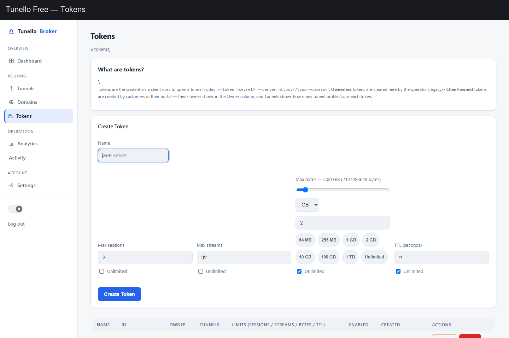
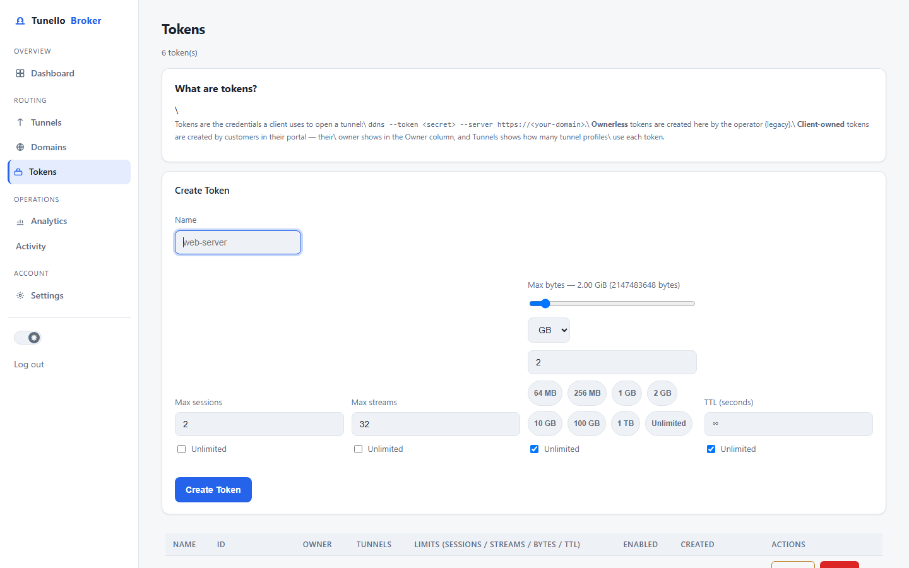
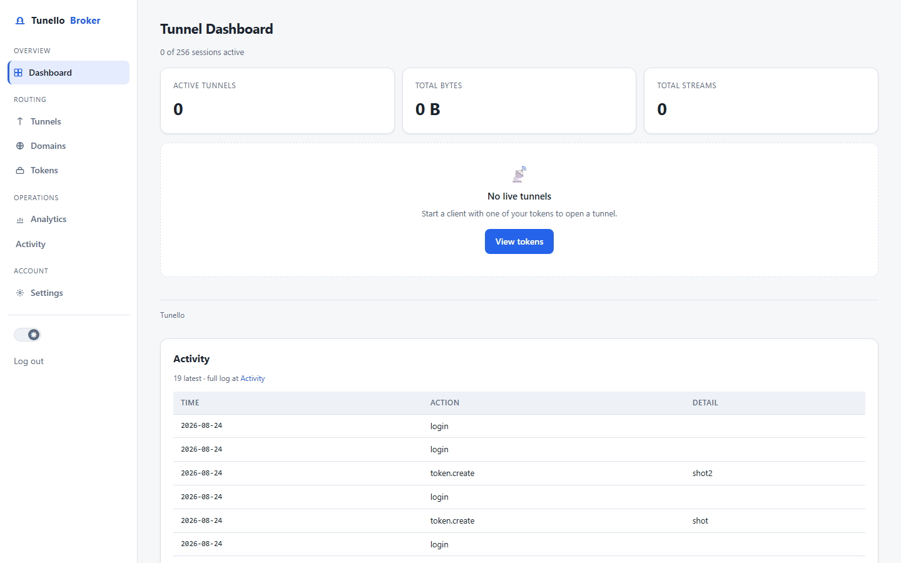
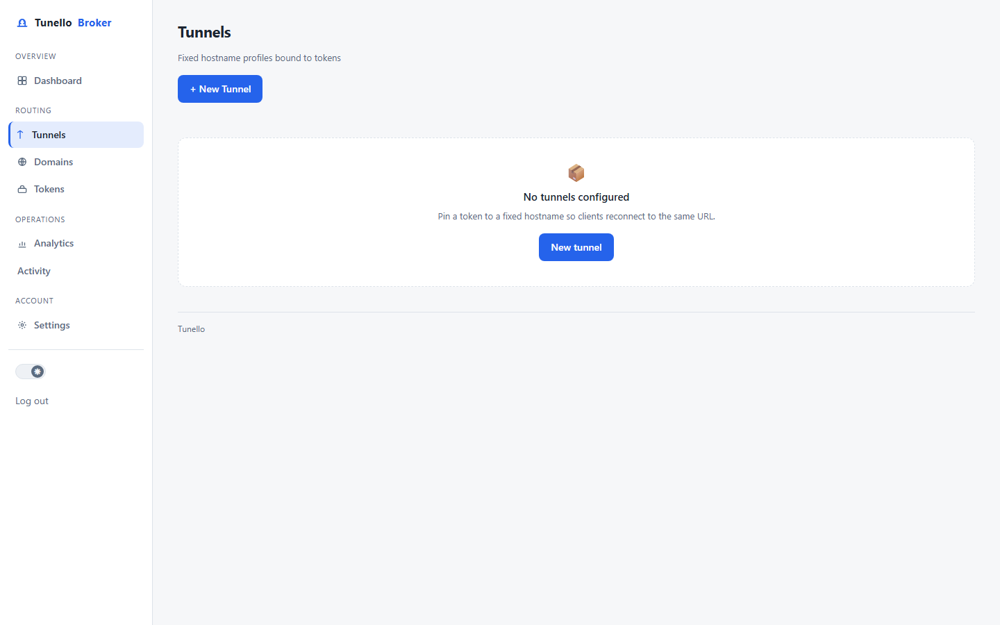
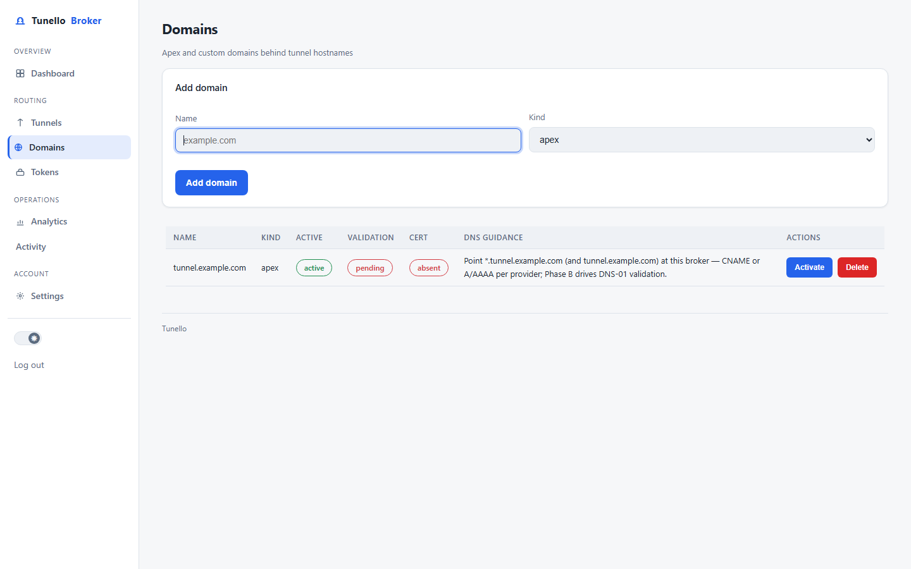
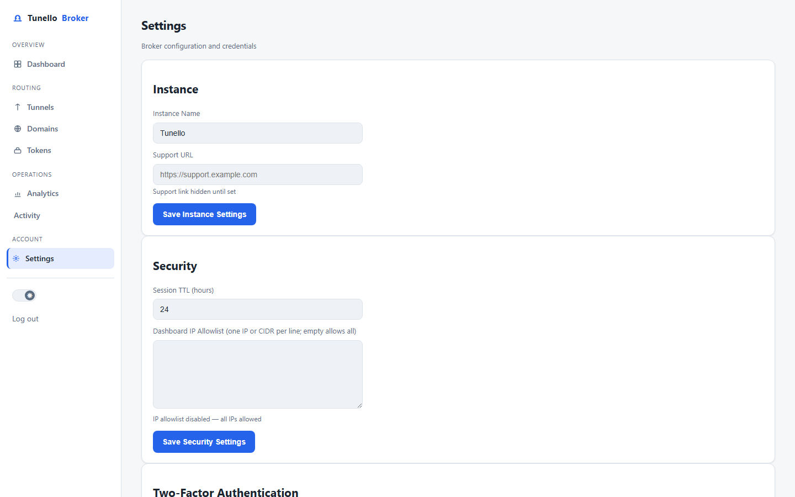

<p align="center">
  
</p>

<h1 align="center">Tunello — self-hosted tunnel service</h1>

<p align="center"><em>Expose local HTTP/TCP services through a secure UDP + WebSocket tunnel — one command from customer to public URL.</em></p>

<p align="center">
  <a href="LICENSE"></a>
  <a href="https://www.rust-lang.org/"></a>
  <a href="https://github.com/tunglamhp/tunnello-free/releases"></a>
  <a href="https://github.com/tunglamhp/tunnello-free/releases"></a>
</p>

A tunnel-service SaaS: expose local HTTP/TCP services through a secure WebSocket
tunnel with a stable public hostname. Ships with an operator dashboard (tokens,
tunnels, custom domains, sessions,
usage metering).

```
visitor ──https──▶ Tunello broker ◀──wss── ddns-client ──http/tcp──▶ your local app
```

## Features

- [Service Templates](docs/SERVICE-TEMPLATES.md) — pre-configured tunnel profiles (SSH, RDP, MySQL, Home Assistant, Plex, MQTT...)
- [Device Guides](docs/DEVICE-GUIDES.md) — step-by-step setup for Raspberry Pi, Synology NAS, Windows, macOS, Docker, Home Assistant

- **One-line tunnel** — `curl -sSL "https://host/install.sh?code=sc_xxx&port=8080" | sh`
  installs the client and opens the tunnel; the raw token secret never leaves the broker.
- **HTTP + TCP forwarding** — one HTTP and one TCP target per session; stable public
  hostname, random or pinned subdomains, custom domains.
- **P2P data plane** — browser visitors bypass the broker over WebRTC/DTLS data channels
  when NAT allows, with automatic relay fallback; quota metering still applies.
- **Operator dashboard** — tokens & limits, tunnels, custom domains (ACME), live sessions,
  activity audit.
- **Per-token Quickstart one-liners** — hand a customer a single install line.
- **Static client binaries (4–6 MB)** — Linux/macOS/Windows, cross-compiled,
  installable with the same one-liner.
- **Single-command VPS deployment** — Docker Compose + one-click scripts, home/VPS
  failover with Porkbun DDNS.

<p align="center">
  
</p>

<p align="center">
  
  
</p>
<p align="center">
  
  
  
</p>

## Repository layout

| Crate | Role |
|---|---|
| `crates/ddns-server` | Broker: TLS listener, tunnel multiplexing, operator dashboard, usage |
| `crates/ddns-client` | Static client binary: `ddns --token … --port 8080` opens the tunnel |
| `crates/ddns-proto` | Wire protocol (control frames, stream framing, kill reasons) |
| `crates/ddns-echo` | Tiny local echo app used by the demo |


## Client install guide (Windows / Linux / macOS)

See [docs/CLIENT-GUIDE.md](docs/CLIENT-GUIDE.md) for per-platform install,
auto-start (systemd / launchd / Task Scheduler), P2P quick connect and
troubleshooting.

## Quick start — local demo

One script runs the whole stack locally (dev self-signed cert, operator account,
token, echo app, tunnel) and prints a working tunnel URL:

```powershell
# from the repo root
powershell -ExecutionPolicy Bypass -File demo/demo.ps1
```

The script leaves the broker, echo app and tunnel client running; the proof
command it prints reaches your local echo app *through* the tunnel. See
`demo/demo.ps1` for details and `Stop` instructions.

## Operator guide

### First run

```bash
ddns-server --dev --domain tunnel.example.com --listen 127.0.0.1:8443
# or with a real certificate:
ddns-server --domain tunnel.example.com --cert fullchain.pem --key privkey.pem
```

Open `https://<host>:<port>/` → `/setup` creates the operator account. Dev mode
writes `<db>.dev-ca.pem` (the trust anchor for `ddns-client --ca-pem`).

### Dashboard pages

- **Tokens** — create/disable/delete API tokens; each token carries its own limits
  (`max_sessions`, `max_streams`, `max_bytes`, `ttl_secs`; `0` = unlimited).
- **Tunnels** — pin a token to a fixed subdomain or custom hostname; enable/disable.
- **Domains** — apex + wildcard domains; ACME certificates; validation status.
- **Sessions** — live tunnels: slug, token, streams, traffic, per-session kill.
- **Clients** — client accounts: activate a plan for N days (manual channel),
  suspend (drop to Free), inspect details.
- **Codes** — generate single-use prepaid codes (plan + duration); delete.
- **Analytics** — usage totals, top accounts, per-account table (`usage_daily`).

### P2P data plane

Browser visitors skip the broker when NAT allows: the broker serves a small
connector page whose Service Worker opens a WebRTC `DTLS` data channel straight
to the client, so tunnel data bypasses the broker (which stays in the control
plane — signaling, tickets, metering). `DDNS_STUN_PORT` (default `3478/udp`)
is the broker's self-hosted STUN endpoint used for hole-punching; the Compose
file maps it by default, so open it on the VPS firewall.

- **Fallback** — no WebRTC/Service Worker support, an ICE timeout, or a failed
  punch falls back to the existing broker relay automatically; visitors see no
  difference except timing. Quota metering still applies: the client reports
  P2P bytes over the control WSS and the watchdog kills over-quota sessions.
- **Tunneled-app WebSockets** — a Service Worker cannot intercept WebSockets
  opened by the tunneled app, so those ride the relay path (only HTTP(S) uses
  P2P). Force the relay path for a request with the `X-Tunnello-Relay: 1`
  header.

**VPS resource note** — on a 2 vCPU / 4 GB VPS, P2P is what keeps the broker
viable: in the happy path it carries only control traffic, not tunnel data.
Keep `--max-sessions` ≤ 128 (and the server-wide per-session stream cap on) so
the relay fallback — the only bandwidth-heavy path — stays bounded.

### Environment variables

| Variable | Purpose |
|---|---|
| `DDNS_BASE_URL` | Link origin for verification/reset emails (default `http://127.0.0.1:<port>`) |
| `DDNS_SMTP_HOST/PORT/USER/PASS/FROM` | Email delivery; `DDNS_SMTP_TLS=starttls\|tls\|none` |
| `DDNS_HEARTBEAT_MS` | Client heartbeat override (ddns-client) |
| `DDNS_STUN_PORT` | Broker self-hosted STUN UDP port for P2P hole-punching (default `3478`) |

Optional: without SMTP keys the service still works (dev mode logs
verification links instead of sending email).

## Client guide

```bash
ddns --token TOKEN --server https://tunnel.example.com --port 8080
ddns --token TOKEN --server https://127.0.0.1:8443 --port 8080 --ca-pem ddns.db.dev-ca.pem   # local dev
ddns --token TOKEN --tcp 22            # raw TCP forwarding
ddns --token TOKEN --local http://127.0.0.1:3000 --local tcp://127.0.0.1:5432
```

- `--server` accepts `https://` or `wss://` (default `https://tunnel.example.com`).
- TLS: system roots by default; `--ca-pem` adds a custom CA (dev certs).
- On registration the client prints its public URL; traffic to it is relayed to
  your local target. Reconnects automatically with the same subdomain when a
  profile pins one (operator **Tunnels** page); otherwise a fresh random slug.

### `ddns connect` (P2P TCP)

```bash
ddns connect https://sub.tunnel.example.com
```

Native visitor side: punches a WebRTC data channel straight to the tunnel's
TCP target so traffic bypasses the broker. On success the helper binds a local
port and prints:

```
Forwarding TCP 127.0.0.1:PORT → sub (P2P)
```

- Connect to the printed `127.0.0.1:PORT` — TCP now flows P2P.
- On punch failure the helper prints the broker relay address; the usual relay
  path still works.
- No token needed. Only the broker's self-hosted STUN (UDP 3478) must be
  reachable from the helper.

## Client portal

`https://<host>/portal` — sign up (email + password, verification email; dev

- **Usage** — today/this-month cards and a 30-day chart.
- **Tunnels / Domains** — mirror views of your tokens' profiles and domains.
- **API** — manage tokens under your plan caps: `POST /portal/api/tokens`,
  `DELETE /portal/api/tokens/:id`.

### One-line tunnel (Quickstart)

Every tunnel row on the portal **Tunnels** page has a **Quickstart** action. It
issues a fresh single-use setup code and renders one copy-paste command:

```bash
curl -sSL "https://<host>/install.sh?code=sc_xxx&port=8080" | sh
```

Pasting it on the machine running the service installs the client and opens the
tunnel with that tunnel's token + ports — the raw `tok_` secret never leaves the
broker. The `sc_` code is single-use, expires in 7 days, and refreshing the page
issues a new one.

grace). Effective limits are snapshotted per session — running sessions keep
their quota until the client reconnects.

## TLS certificates

Automatic Let's Encrypt via **TLS-ALPN-01** on port 443 (works out of the box).

> **Note:** DNS-01 validation is not yet automated — the `--acme-provider`
> selection is recorded but issuance always uses TLS-ALPN-01. Wildcard
> certificates therefore require manual provisioning for now.

## Development

```bash
cargo test --workspace -q          # full suite (34 test binaries)
cargo clippy --workspace --all-targets -q -- -D warnings
cargo fmt --all -- --check
```

The operator dashboard's client-side islands (`crates/ddns-web`, Dioxus) need
the `wasm32-unknown-unknown` target and `dioxus-cli` to build:

```bash
rustup target add wasm32-unknown-unknown
cargo install dioxus-cli          # or the official installer
dx bundle --platform web --package ddns-web
```

The bundle is written to `dist/public` and served by the broker at
`/_assets/wasm/ddns-web.js` (via `--web-dist dist/public`, the default).

- Rust 2024, axum 0.8, rusqlite (single shared connection; guards must never
  cross an `.await`), server-rendered HTML pages; client islands built via
  `dx bundle` (see Development) — one CSS system with a light/dark theme
  toggle (`localStorage` + OS preference).
- Integer epoch timestamps everywhere; `usage_daily.day` is UTC `YYYY-MM-DD`.
- No CSS gradients anywhere; flat solid fills only.
- Design docs live in `docs/superpowers/specs/`, implementation plans in
  `docs/superpowers/plans/`, per-plan SDD ledgers in `.superpowers/sdd/`.

## License

[MIT](LICENSE) — see the LICENSE file for the full text.
